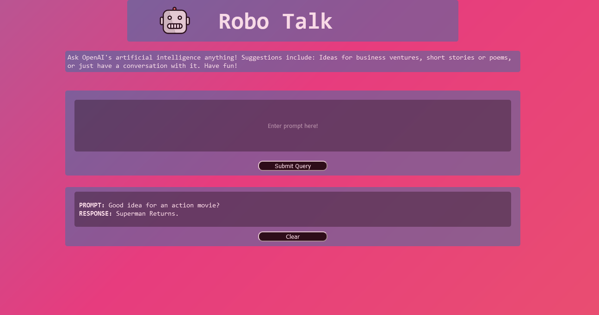

# Shopify-Challenge-FrontEnd-Developer

## Objective

Create a simple application that interacts with the OpenAI API. 

  ## Table of Contents 
- [Objective](#objective)
- [Description](#description)
- [Deployment](#deployment)
- [Githubs](#githubs)

## Description

OpenAI is an AI research and deployment company with a mission is to ensure that artificial general intelligence benefits all of humanity. This application makes use of OpenAIs API to generate responses based upon prompts.

## Deployment

https://robotalk.netlify.app/

### Built With

* [HTML](https://developer.mozilla.org/en-US/docs/Web/HTML)
* [CSS](https://developer.mozilla.org/en-US/docs/Web/CSS)
* [Javascript](https://developer.mozilla.org/en-US/docs/Web/JavaScript)
* [React.js](https://reactjs.org/)

## Author

* [Omar](https://github.com/OmarAce)